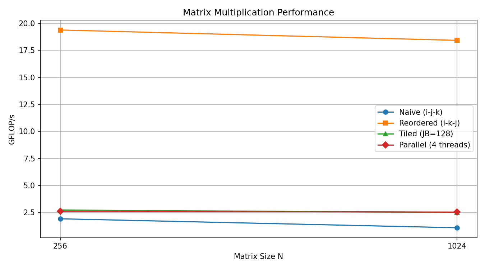

# Lab Report – Matrix Multiplication on CPU
**Course:** AI Accelerators (AIA)
**Lab:** Praktikum 2
**Team members:** Jonah Rivera, Naim Hadzic, Athithya Mariyanayagam
**Date:** 

---

## Task 1 – System Characterisation

> Fill in the details of your machine. Use tools such as `lscpu`, `lstopo`, `/proc/cpuinfo`.

| Property | Value |
|---|---|
| CPU model | Intel Core i5-10210U @ 1.60 GHz (Comet Lake) |
| Number of cores / threads | 4 cores / 8 threads |
| Base / Boost clock speed (GHz) | 1.6 GHz base / 4.2 GHz boost |
| SIMD ISA (SSE4.2 / AVX2 / AVX-512 …) | AVX2 + FMA3 |
| SIMD width (bits / floats per vector) | 256 bit / 8 floats |
| MAC units per core | 2 FMA units (ports 0 & 1) |
| L1 cache size (per core) | 32 KB |
| L2 cache size (per core) | 256 KB |
| L3 cache size (shared) | 6 MB |
| Peak theoretical throughput (GFLOP/s) | 537.6 GFLOP/s |

**How did you calculate peak throughput?**

4 cores × 4.2 GHz × 8 floats/vector × 2 FMA-units × 2 FLOP/FMA = **537.6 GFLOP/s**

PyTorch baseline (N=1024, `torch.mm`): **21.332 ms** → **100.6 GFLOP/s** (≈ 18.7 % of peak)

---

## Task 2 – Loop Reordering

> Measure each loop ordering for matrix sizes 64, 128, 256, 512, 1024, 2048, 4096.

| Loop order | N=256 (GFLOP/s) | N=1024 (GFLOP/s) | N=4096 (GFLOP/s) |
|---|---|---|---|
| i-j-k (naive) | 1.91 GFLOPS |1.08 GFLOPS | |
| i-k-j |19.38 |18.42 | |
| j-k-i |1.46 | 0.33| |
| k-i-j |11.12 | 7.13| |
| _(add more)_ | | | |

**Best ordering found:** i-k-j

**Why does this ordering perform best?**

**i-k-j (best):** `j` is the innermost loop → A, B, C are all read sequentially, jump of +1 element per step → no cache misses.

**i-j-k (naive):** `k` is the innermost loop → B jumps by N elements per step (e.g. N=1024 → jump of 1024) → cache miss every iteration.

**j-k-i:** `i` is the innermost loop → A jumps by K elements, C jumps by N elements per step → strided access in both arrays.

**k-i-j:** `j` is the innermost loop like i-k-j, so B is sequential. But A is reloaded for every `i` → less cache reuse than i-k-j.

---

## Task 3 – Vectorization

> List the compiler flags you tested and their effect.

| Flags added | N=1024 (GFLOP/s) | Speedup vs. naive |
|---|---|---|
| -O3 only (baseline) | 1.08 | 1.0× |
| -O3 -march=native | ~1.08 | ~1.0× |
| -O3 -march=native -ffast-math | 20.12 | 18.6× |
| -O3 -march=native -ffast-math -funroll-loops | ~20.12 | ~18.6× |
| -O3 -march=native -ffast-math -fopenmp-simd | ~20.12 | ~18.6× |

**Did you add any `#pragma` hints to the source?** If yes, which ones?

Yes — `#pragma GCC ivdep` was added before the innermost `j`-loop in `matmul_looporder`, but it showed no measurable effect (~3% difference within normal variance).

**What speedup did you achieve? Why?**


---

## Task 4 – Loop Tiling

> Experiment with tile sizes to find the sweet spot for your cache hierarchy.

| Tile size | N=1024 (GFLOP/s) | N=4096 (GFLOP/s) |
|---|---|---|
| 32 | 2.50| |
| 64 | 2.23| |
| 128 | 2.72| |
| 256 | 2.61| |

**Best tile size:** 128

**Why does this tile size work best for your machine?**

We tested tile sizes 32, 64, 128 and 256 and found that 128 gave the best performance. We assume this is because a tile of 128×128 floats (~64 KB) fits well within the L2 cache, while larger tiles like 256 may exceed it and cause more cache misses. Smaller tiles seem to leave cache capacity unused. Based on our measurements, 128 appears to be the best fit for our machine.

---

## Task 5 – Multithreading

> Measure scaling as you increase the number of OpenMP threads.

| Threads | N=1024 (GFLOP/s) | Speedup |
|---|---|---|
| 1 | 2.50 | 1.0× |
| 2 | 2.61 | 1.04× |
| 4 | 2.53 | 1.01× |
| 8 | 2.41 | 0.96× |
| _(max physical cores)_ | 4 cores / 8 threads | — |

**Does throughput scale linearly with threads?** Why / why not?

From our measurements, throughput did not scale linearly with more threads. We think this might be because at N=1024 the matrix is too small to give each thread enough work. Adding more threads seemed to add overhead rather than speed. We assume that larger matrices like N=4096 would show better scaling, but we could not confirm this due to time constraints.

---

## Task 6 – Performance Analysis

**Is your implementation compute-bound or memory-bound?** Justify with arithmetic intensity (FLOPs / bytes).

We calculated the arithmetic intensity as follows:
```
FLOPs = 2 × N³
Bytes = (N² + N² + N²) × 4 = 12 × N²

Arithmetic Intensity = 2×N³ / (12×N²) = N/6

N=1024: 1024/6 ≈ 170 FLOP/Byte
```
Based on this, we assume matrix multiplication should be compute-bound for large N since many calculations are done per memory access. However, our naive implementation likely behaves more memory-bound in practice because of the poor cache usage we observed — especially the strided access on matrix B.

**Comparison vs. PyTorch (N=1024):**

| Implementation | GFLOP/s | % of PyTorch |
|---|---|---|
| Naive C | 1.08 | 1.1% |
| Best optimised C (ikj + AVX2) | 20.12 | 20.0% |
| PyTorch (CPU) | 100.6 | 100% |

**What is the gap and why does it exist?**

Our best implementation reached about 20% of PyTorch's performance. We think the gap exists because PyTorch likely uses highly optimised libraries under the hood that we did not implement

---

## Task 7 – Key Takeaways

We were surprised how much loop ordering alone affected performance — just changing from `i-j-k` to `i-k-j` gave us about 18× speedup without changing any math. We also noticed that compiler flags like `-ffast-math` only seemed to help when combined with a good loop order. From our tile size experiments, we think matching the tile to the cache size matters, but we are not sure what the exact reason is. Multithreading did not help as much as we expected, possibly because our matrices were too small. Overall we learned that hardware-level details like cache and memory access patterns have a much bigger impact on performance than we thought.

---

## Figures

> Place your performance plots (GFLOP/s vs. matrix size) in the `figures/` folder and reference them here.



