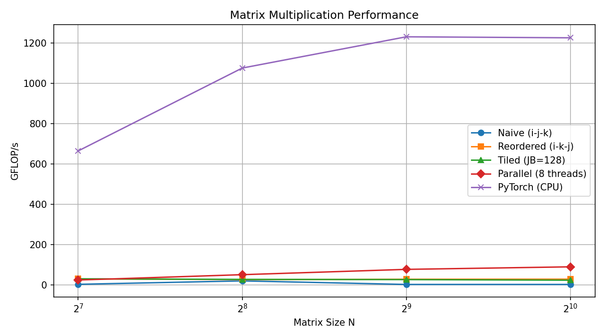

# Lab Report – Matrix Multiplication on CPU
**Course:** AI Accelerators (AIA)
**Lab:** Praktikum 1
**Team members:** _(fill in)_
**Date:** _(fill in)_

---

## Task 1 – System Characterisation

> Fill in the details of your machine. Use tools such as `lscpu`, `lstopo`, `/proc/cpuinfo`.

| Property | Value |
|---|---|
| CPU model | Apple M2 |
| Number of cores / threads | 8/8 |
| Base / Boost clock speed (GHz) | 2.42/­3.5 |
| SIMD ISA (SSE4.2 / AVX2 / AVX-512 …) | ARM NEON / Advanced SIMD|
| SIMD width (bits / floats per vector) | 128 bit / 4× FP32 pro Vektor|
| MAC units per core | 4 |
| L1 cache size (per core) | hw.l1icachesize: 131072  128KB I 64KB D|
| L2 cache size (per core) |  hw.l2cachesize: 4194304 |
| L3 cache size (shared) |  |
| Peak theoretical throughput (GFLOP/s) | 448 GFLOPS/s??|

**How did you calculate peak throughput?**

_(formula: cores × clock × SIMD_width × MACs_per_cycle)_

---

## Task 2 – Loop Reordering

> Measure each loop ordering for matrix sizes 64, 128, 256, 512, 1024, 2048, 4096.

| Loop order | N=512 (GFLOP/s) | N=256 (GFLOP/s) | N=128 (GFLOP/s) | N=64 (GFLOP/s) |
|---|---|---|---|---|
|i-j-k| 1.99 | 2.30 | 2.94 | 3.95 |
|i-k-j| 28.25 | 27.92 | 33.42 | 25.27 |
|j-i-k| 1.86 | 2.03 | 2.51 | 3.62 |
|j-k-i| 0.54 | 0.62 | 2.31 | 2.43 |
|k-i-j| 22.31 | 22.80 | 33.03 | 30.39 |
|k-j-i| 0.54 | 0.64 | 3.25 | 3.91 |

**Best ordering found:** ikj

**Why does this ordering perform best?**

_(Explain in terms of spatial locality and cache reuse of A, B, and C)_

The i-k-j ordering maximizes cache reuse: the innermost j-loop accesses B sequentially (unit stride), the middle k-loop keeps one A row in L1 cache across iterations, and C is updated in row-major order. This minimizes cache misses and memory traffic compared to other orderings.

---

## Task 3 – Vectorization

> List the compiler flags you tested and their effect.

| Flags added | N=1024 (GFLOP/s) | Speedup vs. naive |
|---|---|---|
| -O3 only (baseline) | 1.83| 1.0× |
| -O3 -march=native | 1.82 | 1.0x|
| -O3 -march=native -ffast-math | 1.80 | |
| -O3 -march=native -ffast-math -funroll-loops | 1.84| |
| -O3 -march=native -ffast-math -fopenmp-simd | 1.84| |

**Did you add any `#pragma` hints to the source?** If yes, which ones?

**What speedup did you achieve? Why?**
No speedup
---

## Task 4 – Loop Tiling

> Experiment with tile sizes to find the sweet spot for your cache hierarchy.

| Tile size | N=1024 (GFLOP/s) | N=4096 (GFLOP/s) |
|---|---|---|
| 32 | 16.3| Not feasible|
| 64 | 21.67| Not feasible|
| 128 | 23.3| Not feasible|
| 256 | 23.3 | Not feasible|

**Best tile size:** 64

**Why does this tile size work best for your machine?**

64 kb LVL 1 Cache -> 64x 64 float 32
---

## Task 5 – Multithreading

> Measure scaling as you increase the number of OpenMP threads.

| Threads | N=1024 (GFLOP/s) | Speedup |
|---|---|---|
| 1 | 23| 1.0× |
| 2 | 31| 1.34|
| 4 | 70| 3|
| 8 | 90| 3.9|

**Does throughput scale linearly with threads?** Why / why not?
No (non parallelizable overhead (Amdahls law))
---

## Task 6 – Performance Analysis

**Is your implementation compute-bound or memory-bound?** Justify with arithmetic intensity (FLOPs / bytes).
$AI=\frac{N^3}{N^2*4*3} = 1024/12$ -> Technically compute bound but for the naive implementation it behaves like memorybound because of cache misses

**Comparison vs. PyTorch (N=4096):**

| Implementation | GFLOP/s | % of PyTorch |
|---|---|---|
| Naive C | 1.81| 0%|
| Best optimised C | 90|7% |
| PyTorch (CPU) | 1221| 100% |

**What is the gap and why does it exist?**

Pytorch is heavily optimized and uses all of the cpus resources

---

## Task 7 – Key Takeaways

_Write 3–5 sentences summarising the most important lessons learned from this lab._
Optimizing algorithms for good memory/cache usage is crucial. People shouldnt think python is slow when using optimized libraries.

---

## Figures

> Place your performance plots (GFLOP/s vs. matrix size) in the `figures/` folder and reference them here.

